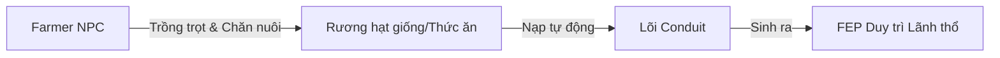

# 🏰 CẨM NANG GAMEPLAY TOÀN DIỆN — TerritoryDefense Plugin

> **Phiên bản:** v37 (Stateful GUI & Dynamic Terrain Engine) | **Server:** Paper 1.21+

---

## 📖 MỤC LỤC

1. [Bắt Đầu — Lãnh Thổ Lõi (Territory Core)](#1-bắt-đầu--lãnh-thổ-lõi)
2. [Năng Lượng FEP & Nông Dân (Logistics)](#2-năng-lượng-fep--nông-dân)
3. [Phòng Thủ — Tháp Canh & Lính Gác (Combat)](#3-phòng-thủ--tháp-canh--lính-gác)
4. [Hệ Thống Raid PvE Động](#4-hệ-thống-raid-pve-động)
5. [Chiến Tranh Công Thành (Siege PvP)](#5-chiến-tranh-công-thành-siege-pvp)
6. [Liên Minh (Alliance System)](#6-liên-minh-alliance-system)
7. [Tài Chính — Nâng Cấp Lõi & Shard](#7-tài-chính--nâng-cấp-lõi--shard)
8. [Lệnh Người Chơi (Player Commands)](#8-lệnh-người-chơi)
9. [Lệnh Admin (Admin Commands)](#9-lệnh-admin)
10. [⚡ Tips & Chiến Thuật Đỉnh Cao](#-tips--chiến-thuật-đỉnh-cao)

---

## 1. Bắt Đầu — Lãnh Thổ Lõi

### 🔷 Lõi Lãnh Thổ là gì?
Lõi Lãnh Thổ (**Conduit**) là **trái tim** của vùng đất. Khi đặt xuống, nó tạo ra một **vùng bảo vệ hình cầu** xung quanh với các đặc tính tối tân:
* **Bảo vệ tuyệt đối**: Ngăn chặn người lạ phá block, mở rương, đặt block hoặc phá hoại cảnh quan.
* **Màng Giáp Ảo (Shield HP)**: Hấp thụ toàn bộ sát thương từ các vụ nổ (TNT, Creeper) và quái Raid trước khi chúng chạm tới công trình bên trong.
* **Định vị ranh giới**: Tháp canh tự động hoạt động bảo vệ vùng biên giới này.

### 🚀 Bước Khởi Đầu
1. Gõ lệnh `/territory getstarter` để nhận miễn phí **Lõi Khởi Đầu (Starter Core)** (Chỉ nhận được 1 lần duy nhất).
2. Đặt Conduit xuống bất kỳ vị trí nào thích hợp trong Overworld → Vùng bảo vệ kích hoạt ngay lập tức.
3. Bước vào vùng bảo vệ và gõ `/territory` (hoặc `/t`) để mở **Stateful GUI điều khiển** Lõi.

### 📐 Cấp Độ Lõi & Chỉ Số Thăng Tiến

| Cấp | Bán kính bảo vệ | Giới hạn Tháp | Dung tích FEP | Giáp Ảo Tối Đa (Shield HP) | Wave PvE Raid | Chi phí nâng cấp |
|:---:|:--------------:|:-------------:|:-------------:|:-------------------------:|:-------------:|:----------------:|
| **1** | 20 block | 3 tháp | 500 FEP | 1,000 HP | 3 Wave | — |
| **2** | 28 block | 7 tháp | 1,500 FEP | 2,500 HP | 3 Wave | 200,000 Xu + 5 Shard |
| **3** | 36 block | 12 tháp | 4,000 FEP | 5,000 HP | 3 Wave | 400,000 Xu + 10 Shard |
| **4** | 44 block | 17 tháp | 10,000 FEP | 10,000 HP | 3 Wave | 700,000 Xu + 15 Shard |
| **5** | 52 block | 22 tháp | 25,000 FEP | 20,000 HP | 5 Wave | 1,000,000 Xu + 20 Shard |

---

## 2. Năng Lượng FEP & Nông Dân

### ⚡ FEP (Food Energy Points) là gì?
FEP là **nhiên liệu sinh học** để Lõi duy trì vùng bảo vệ và nạp lại Giáp Ảo.
* **Tiêu hao liên tục**: **2.0 FEP/giờ**.
* **Khi FEP = 0**: Lõi **sập nguồn**, ranh giới bảo vệ biến mất, các tháp canh ngừng hoạt động và vùng đất rơi vào trạng thái dễ bị tổn thương nhất!

### 🌾 Cách Nạp FEP Thủ Công
1. Cầm **thực phẩm/nông sản** trên tay (bánh mì, lúa, thịt, khoai tây, cà rốt...).
2. Mở GUI Lõi (`/t`) → Chọn Tab **Logistics** (Kính lọc màu Lam).
3. Nhấp chuột vào ô **"Khu Tiếp Tế FEP"** (Kính xanh lá) → FEP tăng ngay lập tức tương ứng với giá trị dinh dưỡng của thực phẩm.

### 🧑‍🌾 Thuê Nông Dân NPC (Farmer)
Nông Dân (Farmer) là các NPC tự động làm việc để tự động hóa nguồn cung FEP cho Lõi của bạn.



* **Thuê Farmer**: Mở GUI → Tab **Logistics** → Click vào ô **"Thuê Nông Dân NPC"** (Chi phí tùy thuộc config server).
* **Quản Lý Farmer**: Nhấp chuột phải trực tiếp vào Farmer của phe mình hoặc mở GUI → Tab **Logistics** → **"Quản Lý Nông Dân"** để:
  * Nâng cấp tốc độ canh tác.
  * Mở rộng túi đồ thu hoạch.
  * **Sa Thải** Farmer nếu cần thiết.

> [!TIP]
> Đặt một rương chứa các loại hạt giống gần Lõi để Farmer tự động lấy giống gieo trồng. Farmer cũng sẽ tự động chăn nuôi gia súc gần đó và mang nông sản thu được nạp trực tiếp vào Lõi.

---

## 3. Phòng Thủ — Tháp Canh & Lính Gác

### 🗼 7 Loại Tháp Canh Cổ Đại

Mua tháp trong GUI Lõi → Tab **Combat** (Kiếm sắt) → Nhấp vào loại tháp mong muốn. Sau khi mua thành công, **cầm vật phẩm tháp trên tay và nhấp chuột phải** vào khối block bất kỳ để đặt.

| Tháp Canh | Icon GUI | Chi phí | Tầm bắn | Đặc tính & Kỹ năng |
|:---:|:---:|:---:|:---:|:---|
| **🏹 Tháp Cung** *(Skeleton)* | Đầu Skeleton | 60,000 Xu | 16 block | Bắn mũi tên xuyên thấu gây sát thương tối đa 3 kẻ địch trên một đường thẳng. |
| **⚡ Tháp Sét** *(Creeper)* | Đầu Creeper | 90,000 Xu | 12 block | Triệu hồi sấm sét giật diện rộng (AoE) cực mạnh lên nhóm kẻ địch. |
| **🔥 Tháp Hỏa** *(Blaze)* | Đầu Wither | 100,000 Xu | 10 block | Bắn hỏa cầu thiêu đốt liên tục, gây sát thương theo thời gian (DoT). |
| **❄️ Tháp Băng** *(Stray)* | Đầu Zombie | 80,000 Xu | 14 block | Gây sát thương tầm trung kèm hiệu ứng **làm chậm 50% di chuyển** của mục tiêu. |
| **💥 Tháp Pháo** *(Ghast)* | Đầu Rồng | 130,000 Xu | 18 block | Tầm cực xa, dội bom pháo kích AoE nổ diện rộng, phá hủy giáp địch. |
| **💚 Tháp Hồi Phục** *(Evoker)* | Đầu Piglin | 110,000 Xu | 8 block | Không tấn công, liên tục hồi máu (HP) cho đồng minh và lính gác lân cận. |
| **🔮 Tháp Ma Pháp** *(Witch)* | Đầu Player | 140,000 Xu | 12 block | Tăng **+15% sát thương** cho tất cả các Tháp phòng thủ đặt xung quanh nó. |

> [!IMPORTANT]
> **CƠ CHẾ ĐẶC BIỆT**: Tháp canh cổ đại **không tấn công quái vật Raid PvE** để đảm bảo tính cân bằng chiến thuật. Tháp chỉ nhắm mục tiêu vào **người chơi địch (Siege)** và **quái vật tự nhiên xâm nhập**.

### ⚔️ Lính Đánh Thuê (Mercenaries)
Mở GUI → Tab **Combat** → Nút **"Lính Đánh Thuê"** để chiêu mộ các chiến binh bảo vệ tuần tra tự động:

* **⚔️ Cận Chiến (Melee)** *(100,000 Xu)*: Cực kỳ lì lợm, chuyên lao vào cản đường, đánh xáp lá cà thu hút sát thương.
* **🏹 Cung Thủ (Archer)** *(90,000 Xu)*: Đứng từ xa bắn yểm trợ liên tục từ các vị trí an toàn trên cao.
* **🛡️ Công Thành (Siege)** *(240,000 Xu)*: Lượng HP khổng lồ, chịu đòn siêu hạng để bảo vệ các Tháp phòng thủ cốt lõi.
* **💛 Hỗ Trợ (Support)** *(120,000 Xu)*: Liên tục buff giáp và hồi phục sinh lực cho toàn đội hình lính gác.
* **🔵 Gác Cổng (Guard)** *(Miễn phí theo cấp Lõi)*: Đi tuần tra xung quanh ranh giới, giữ an ninh chung.

> [!NOTE]
> **Bảo Vệ Đồng Minh (Anti-Friendly Fire)**: Hệ thống tự động bảo vệ đồng minh trong Liên Minh, triệt tiêu hoàn toàn sát thương bắn nhầm giữa người chơi, lính gác, và tháp canh cùng phe.

---

## 4. Hệ Thống Raid PvE Động

### 🌀 Raid Tự Động (Scheduled Raid)
* Mỗi khi đến **giờ chẵn** (0h, 2h, 4h... 22h) và **chủ Lõi đang online**, một Cổng Không Gian sẽ mở ra ở rìa lãnh thổ.
* Quái vật Raid sẽ hành quân theo nhóm hướng thẳng về phía Lõi. Chúng **không phá hủy các block tự nhiên** mà chỉ tập trung **phá hủy vật cản nhân tạo** (tường, block phòng thủ) chắn đường đi đến Lõi.
* Nếu **Shield HP của Lõi về 0**: Raid thất bại, Lõi sẽ bị sập nguồn tạm thời.

### 📞 Raid Chủ Động (Call Raid) & Cơ Chế Tăng Giá Động
Mở GUI → Tab **Combat** → **"Kích Hoạt Raid Chủ Động"** để gọi quái ngay lập tức và farm tài nguyên.

**Công thức tăng trưởng (Dynamic Scaling):**
* Mỗi lần gọi Raid chủ động trong vòng 24 giờ, chi phí sẽ **tăng thêm 30%**, quái mạnh hơn **20%** nhưng phần thưởng Shard rơi ra cũng sẽ **tăng 10%**.
* Chi phí hiển thị trong GUI chính là chi phí thực tế đã áp dụng hệ số tăng trưởng.
* Sau **24 giờ**, hệ thống sẽ tự động reset chi phí về mức giá gốc (200,000 Xu).

| Số Lần Gọi | Chi Phí Gọi Raid | Sức Mạnh Quái | Drop Shard |
|:---:|:---:|:---:|:---:|
| **1 (Lần đầu)** | 200,000 Xu | 100% | 100% |
| **2** | 260,000 Xu | 120% | 110% |
| **3** | 338,000 Xu | 140% | 120% |
| **4** | 440,000 Xu | 160% | 130% |
| **5** | 572,000 Xu | 180% | 140% |

### 📊 Chỉ Số Độ Khó Động - OTR (Overall Territory Rating)
Độ khó và thuộc tính của quái vật Raid được tính toán linh hoạt dựa trên quy mô phòng thủ thực tế của Lãnh địa của bạn:

$$\text{OTR} = \text{Core Level} + (\text{Tower Count} \times 0.5) + (\text{Total Tower Levels} \times 0.2) + (\text{Completed Raids} \times 0.1)$$

* **Số lượng quái tối đa**: Thăng tiến theo OTR (từ 10 đến 60 con mỗi Wave).
* **Cường hóa quái**: Sát thương/Giáp quái tăng **+4%**, Máu tối đa tăng **+6%** cho mỗi điểm OTR.

### 🗺️ Cơ Chế Spawn Quái Theo Địa Terrain Thực Tế
Quái vật sẽ biến dị tùy thuộc vào môi trường xung quanh điểm xuất phát của chúng:
* 🌊 **Dưới nước (Sông, Biển)**: Gọi ra quái bơi lội và bay lượn (`Drowned`, `Guardian`, `Phantom`).
* 🏔️ **Núi cao (Y > Lõi + 15 blocks)**: Gọi ra quái bắn tầm xa và dội bom lửa từ trên cao (`Skeleton`, `Pillager`, `Phantom`, `Ghast`).
* 🌾 **Đồng bằng & Thung lũng**: Đội quân hỗn hợp cận chiến và ma thuật (`Vindicator` cầm rìu, `Witch` ném thuốc độc, `Evoker` triệu hồi nanh vuốt).

### 🛡️ Khiên Hòa Bình & Bỏ Qua Raid
Nếu cảm thấy phòng tuyến không đủ vững chắc trước đợt Raid hiện tại:
* Mở GUI → Tab **Combat** → Chọn **"Bỏ Qua Raid & Khiên 2 Giờ"** (Chi phí: **200,000 Xu**).
* Tác dụng: Xóa sạch toàn bộ quái Raid hiện tại ngay lập tức và kích hoạt **Khiên Hòa Bình bảo vệ trong 2 giờ** (Miễn nhiễm hoàn toàn mọi cuộc Raid và Siege từ phe khác).

---

## 🌟 5. SIÊU CẤP MINI-BOSS & CỔ VẬT THƯỢNG CỔ

Trong quá trình triệu hồi quái Raid (cả tự động lẫn chủ động), có **0.5% tỉ lệ** một sinh vật đột biến cực kỳ nguy hiểm xuất hiện: **★ SIÊU CẤP MINI-BOSS ★** (Chỉ xuất hiện tối đa 1 con mỗi đợt Raid).

```
   ===========================================================
    [CẢNH BÁO] SIÊU CẤP MINI-BOSS ĐÃ XUẤT HIỆN Ở RÌA LÃNH THỔ!
   ===========================================================
```

### ☣️ Thuộc Tính Đột Biến Của Mini-Boss:
* **Siêu sinh lực & Sát lực**: Máu nhân thêm **$5.0 \times$**, Sát thương nhân thêm **$3.0 \times$** so với bản thể gốc.
* **Xuyên Shield Tuyệt Đối**: Mini-boss bỏ qua hoàn toàn màng Giáp Ảo (Shield HP) của Lõi. Chúng tiến thẳng vào bên trong và phá hủy các block phòng thủ với tốc độ nhanh gấp **3 lần** quái thường (chỉ mất đúng 1 tick để đập vỡ block).
* **Kháng 90% Hiệu Ứng Khống Chế**:
  * Giảm **90% lực đẩy lùi (Knockback)** nhận vào.
  * Giảm **90% thời gian tác dụng** của mọi hiệu ứng làm chậm di chuyển (Slowness).
* **Trạng Thái Vĩnh Cửu**: Mặc định trang bị giáp Netherite bảo vệ, nhận vĩnh viễn hiệu ứng *Tốc độ II, Kháng cự II, Kháng lửa*.
* **Yêu Cầu Tiêu Diệt**: **Chỉ khi tiêu diệt được Mini-Boss** thì tiến trình Raid mới được tính là kết thúc thành công!

### 💎 Phần Thưởng Huyền Thoại Khi Hạ Gục:
* 💰 Cộng ngay **25 Shards** trực tiếp vào số dư lưu trữ của Lõi Lãnh Thổ chủ quản.
* 📦 Rơi ngẫu nhiên **1 Trang Bị Netherite Thượng Cổ** (Mũ, Giáp, Quần, Giày, Kiếm, Rìu, Cúp, Xẻng, Cuốc) sở hữu **ĐÚNG 10 DÒNG ENCHANTMENT NGẪU NHIÊN** (Bao gồm các dòng bùa chú cực hạn, vượt quá giới hạn an toàn của vanilla)!

---

## 6. Chiến Tranh Công Thành (Siege PvP)

### 🚩 Cờ Công Thành (Siege Flag)
Mua tại GUI Lõi → Tab **Combat** → **"Mua Cờ Công Thành"** (Chi phí: **20,000 Xu**).

```
   [HƯỚNG DẪN TRANG BỊ] ĐẶT CỜ CÔNG THÀNH VÀO TAY TRÁI (OFF-HAND) ĐỂ KÍCH HOẠT SỨC MẠNH!
```

**Tác dụng khi cầm cờ trên tay trái (Off-hand):**
* Cho phép tấn công trực tiếp vào **Màng Giáp Ảo (Shield HP)** của Lõi đối phương.
* Cho phép phá block và đặt block tạm thời trong lãnh thổ kẻ địch.
* Buff vương quyền cho bản thân và đồng đội lân cận:
  * ⚔️ Tăng **+10% sát thương gây ra**.
  * 🛡️ Tăng **+20% khả năng phòng thủ** (Giảm 20% sát thương nhận vào).

> [!WARNING]
> Nếu **không trang bị Cờ Công Thành ở tay trái**, bạn sẽ hoàn toàn **KHÔNG THỂ gây sát thương** lên Giáp Lõi của kẻ địch và không thể phá block trong vùng bảo vệ của họ.

### ⚔️ Quy Trình Tuyên Chiến & Chinh Phục
1. Mở GUI Liên Minh (`/ally`) → Chọn **"Tuyên Chiến Quốc Gia"** hoặc dùng lệnh `/ally declare <tên_đối_thủ>`.
2. Đối phương sẽ nhận được thông báo tuyên chiến chính thức.
3. Mang theo **Siege Flag** tiến vào ranh giới lãnh thổ đối địch để công phá Lõi của chúng.
4. Khi **Shield HP của Lõi địch về 0**, bạn đã chinh phục thành công!

### 💰 Kết Thúc Chiến Tranh — Nộp Thuế hay Di Dời
Kẻ bị chinh phục sẽ có hai lựa chọn sinh tồn:
* **Chấp Nhận Nộp Thuế (`/territory accepttax`)**: Đóng một khoản thuế phạt từ tài khoản cho phe thắng để giữ nguyên vị trí Lõi và tiếp tục hoạt động.
* **Từ Chối & Di Cư (`/territory migrate`)**: Đóng gói thu hồi toàn bộ Lõi cùng tháp canh thành vật phẩm trong túi đồ để di dời sang vùng đất khác lánh nạn.

---

## 7. Liên Minh (Alliance System)

### 🤝 Lợi Ích Của Liên Minh
* **🔕 Tắt Friendly Fire**: Không gây sát thương nhầm lên đồng đội, lính gác hoặc trụ của nhau.
* **📦 Rương Liên Minh**: Kho lưu trữ dùng chung an toàn tối mật cho toàn liên minh.
* **🏗️ Đồng Lòng Kiến Thiết**: Cho phép các thành viên xây dựng và đặt tháp canh hỗ trợ lẫn nhau trong ranh giới chung.
* **🗺️ Hợp Nhất Đất Đai (Land Merge)**: Liên kết các ranh giới Lõi ở cạnh nhau để nhận siêu buff cộng hưởng.

### 📦 Rương Liên Minh (Alliance Chest)
* Mở nhanh bằng lệnh `/ally chest` hoặc qua GUI Liên Minh → **"Hòm Đồ Liên Minh"**.
* **Thành viên thường**: Có thể nạp vật phẩm, Shard vào rương tự do.
* **Thủ Lĩnh**: Có toàn quyền rút **Shard** và các vật phẩm giá trị cao ra ngoài.
* 🔒 **Tự Động Khóa Khẩn Cấp**: Rương sẽ tự động khóa tính năng rút đồ nếu bất kỳ thành viên nào trong Liên Minh đang bị **Raid hoặc Siege** tấn công nhằm chống tẩu tán tài sản.

### 🗺️ Gộp Lãnh Địa (Land Merge)
Khi đặt các Lõi của đồng minh ở gần phạm vi liên kết:
* Mở GUI Lõi → Tab **Finance** (Vàng) → Chọn **"Gộp Lãnh Địa Liên Minh"**.
* **Hiệu quả cộng hưởng cực đại**: Mỗi Lõi tham gia liên kết sẽ đóng góp **+5%** vào Giáp Ảo (Shield HP), Sát thương Tháp canh, Dung tích chứa FEP, Tốc độ hồi FEP và cộng thêm **+1%** phần thưởng tài chính (Xu).
* Click lại lần nữa để **Hủy gộp** nếu muốn tách ranh giới độc lập.

---

## 8. Tài Chính — Nâng Cấp Lõi & Shard

### 💰 Tổng Hợp Chi Phí Hệ Thống

| Chức Năng / Vật Phẩm | Chi Phí Mua (Xu) |
|:---|:---:|
| **Nhận Lõi Khởi Đầu (Starter Core)** | **MIỄN PHÍ** (1 lần) |
| **Thành lập Liên Minh** | **50,000 Xu** |
| **Cờ Công Thành (Siege Flag)** | **20,000 Xu** |
| **Khiên Hòa Bình (2 Giờ)** | **200,000 Xu** |
| **Gọi Raid Chủ Động lần 1** | **200,000 Xu** *(Giá tăng động các lần sau)* |
| **Tháp Cung (Skeleton)** | **60,000 Xu** |
| **Tháp Băng (Stray)** | **80,000 Xu** |
| **Tháp Sét (Creeper)** | **90,000 Xu** |
| **Tháp Hỏa (Blaze)** | **100,000 Xu** |
| **Tháp Hồi Phục (Evoker)** | **110,000 Xu** |
| **Tháp Pháo (Ghast)** | **130,000 Xu** |
| **Tháp Ma Pháp (Witch)** | **140,000 Xu** |
| **Lính Cung Thủ** | **90,000 Xu** |
| **Lính Cận Chiến** | **100,000 Xu** |
| **Lính Hỗ Trợ** | **120,000 Xu** |
| **Lính Công Thành** | **240,000 Xu** |

### 💎 Shard (Mảnh Không Gian) — Dùng Làm Gì?
Shard là tài nguyên quý hiếm nhận được thông qua việc diệt quái Raid.
* **Nâng cấp cốt lõi**: Yêu cầu bắt buộc để nâng cấp Lõi lên Cấp 2, 3, 4, 5.
* **Nâng cấp NPC**: Dùng để tối ưu hóa sức mạnh và tốc độ của Farmer NPC.
* **Giao thương**: Bán lên Chợ Server (Server Shop) để thu hồi lượng lớn Xu.

> [!IMPORTANT]
> **Chống AFK Farm**: Người chơi phải tham gia đóng góp **ít nhất 30% tổng sát thương** gây ra cho quái vật Raid thì mới nhận được phần thưởng Shard khi quái chết.

### 🏦 Cơ Chế Rút Shard
* Shard kiếm được từ Raid sẽ tự động tích lũy vào Lõi.
* Mở GUI Lõi → Tab **Finance** → Click **"Rút Shard Tích Lũy"** để chuyển đổi thành vật phẩm vật lý (Prismarine Shard) trong hành trang.
* Yêu cầu hành trang có ít nhất 1 ô trống. Chỉ có **Chủ Lõi** mới có quyền thực hiện hành động này.

---

## 9. Lệnh Người Chơi (Player Commands)

### 🏰 Lệnh Lãnh Thổ (Territory Core)
> **Aliases viết tắt**: `/territory`, `/t`, `/core`, `/lanhtho`

| Lệnh | Mô Tả Chi Tiết | Yêu Cầu & Điều Kiện |
|:---|:---|:---|
| `/territory` | Mở nhanh giao diện GUI điều khiển Lõi (Logistics, Combat, Finance) | Đang đứng trong ranh giới Lõi của mình |
| `/territory getstarter` | Nhận miễn phí **Lõi Khởi Đầu** dạng khối Conduit | Chưa từng sở hữu Lõi nào trước đây |
| `/territory boundary` | Bật/tắt hiển thị hiệu ứng hạt ranh giới bảo vệ hình cầu | Không tốn phí, hoạt động ở mọi nơi |
| `/territory accepttax` | Đồng ý nộp thuế phạt định kỳ cho bang hội đã chinh phục mình | Đứng gần Lõi của mình sau khi bị Siege thất bại |
| `/territory migrate` | Từ chối nộp thuế, đóng gói toàn bộ Lõi để di cư đi nơi khác | Đứng sát bên Lõi Conduit của mình |
| `/territory help` | Xem toàn bộ hướng dẫn lệnh Lãnh Thổ trong game | Hoàn toàn miễn phí |

---

### 🤝 Lệnh Liên Minh (Alliance System)
> **Aliases viết tắt**: `/ally`, `/a`, `/alliance`, `/lienminh`

| Lệnh | Mô Tả Chi Tiết | Chi Phí / Yêu Cầu |
|:---|:---|:---|
| `/ally` | Mở giao diện menu chính của Liên Minh | Không tốn phí |
| `/ally create <tên>` | Thành lập Liên Minh mới với tên chỉ định | **50,000 Xu** |
| `/ally invite <tên_player>` | Gửi lời mời gia nhập Liên Minh cho người chơi khác | Người gọi phải là **Thủ Lĩnh** |
| `/ally kick <tên_player>` | Trục xuất một thành viên ra khỏi Liên Minh | Người gọi phải là **Thủ Lĩnh** |
| `/ally leave` | Rời khỏi Liên Minh hiện tại | Đang là thành viên |
| `/ally disband` | Giải tán Liên Minh vĩnh viễn (hoặc `/ally delete`) | Người gọi phải là **Thủ Lĩnh** |
| `/ally chat <nội dung>` | Chat nhanh trong kênh truyền tin nội bộ Liên Minh | Đang là thành viên (viết tắt `/ally c <tin>`) |
| `/ally chest` | Mở rương kho đồ dùng chung của Liên Minh | Không bị khóa khẩn cấp (Raid/Siege) |
| `/ally declare <tên>` | Tuyên chiến với một người chơi hoặc bang hội khác | Đối phương phải đang online |
| `/ally deposit <số_tiền>` | Nạp tiền cá nhân vào quỹ ngân khố chung | Đang là thành viên |
| `/ally help` | Xem hướng dẫn tất cả các lệnh của hệ thống Liên Minh | Không tốn phí |

---

### 🖥️ Sơ Đồ Thiết Kế GUI (Stateful GUI Quick Navigation)
Để thuận tiện cho việc điều hướng, dưới đây là sơ đồ bố trí các nút bấm (Slot) trong giao diện `/territory`:

```
/territory (Mở GUI Menu Chính)
│
├── Tab LOGISTICS [Phễu - Hopper]
│   ├── [Slot 13] FEP Gauge — Xem mức năng lượng hiện tại
│   ├── [Slot 20] Thuê Farmer NPC — Chiêu mộ nông dân tự động nạp FEP
│   ├── [Slot 24] Quản Lý Farmer — Nâng cấp tốc độ, hành trang, sa thải
│   └── [Slot 31] Khu Tiếp Tế FEP — Click để nạp nhanh nông sản trên tay
│
├── Tab COMBAT [Kiếm Sắt - Iron Sword]
│   ├── [Slot 13] Shield HP — Hiển thị màng bảo vệ ảo của Lõi
│   ├── [Slot 11] Call Raid — Gọi Raid chủ động (Giá tăng động tịnh tiến)
│   ├── [Slot 15] Bỏ Qua Raid & Khiên 2h — Kích hoạt lá chắn hòa bình tức thì
│   ├── [Slot 17] Quản Lý Tháp Canh — Thống kê vị trí và nâng cấp tháp
│   ├── [Slot 28-34] 6 loại Tháp Canh Cổ Đại — Chọn mua tháp đặt phòng thủ
│   ├── [Slot 38] Sub-GUI Lính Đánh Thuê — Thuê 5 loại chiến binh tuần tra
│   └── [Slot 40] Mua Cờ Công Thành — Mua Siege Flag để đi xâm chiếm
│
└── Tab FINANCE [Khối Vàng - Gold Block]
    ├── [Slot 13] Nâng Cấp Lõi — Nâng cấp bán kính, giới hạn tháp và giáp
    ├── [Slot 20] Gộp Lãnh Địa Liên Minh — Kích hoạt cộng hưởng +5% chỉ số
    ├── [Slot 24] Rút Shard Tích Lũy — Rút Shard vật phẩm vào túi đồ
    └── [Slot 31] Thu Hồi & Di Dời Lõi — Đóng gói Conduit tị nạn
```

---

## 10. Lệnh Admin (Admin Only)
> **Yêu cầu**: Có quyền Quản trị viên tối cao (OP) hoặc sở hữu permission `territorydefense.admin`.

* 🧹 **`/territory resetstarter <tên_player>`**
  * *Tác dụng*: Reset quyền nhận Lõi Khởi Đầu của người chơi và dọn dẹp sạch sẽ toàn bộ Lõi Ma (Ghost Cores) bị kẹt trong bộ nhớ RAM hoặc File lưu trữ do server crash (Hỗ trợ xử lý cả khi player đang Offline).
* 🔎 **`/territory getcore`**
  * *Tác dụng*: Quét vị trí đang đứng và in ra chi tiết thông số kỹ thuật của Lõi gần nhất (Core ID, Tọa độ, Cấp độ, Liên minh chủ quản).

---

## ⚡ Tips & Chiến Thuật Đỉnh Cao

### 🟢 Dành Cho Người Mới Bắt Đầu (Sơ Cấp)
1. **📍 Chọn Vị Trí Đặt Lõi Chiến Thuật**: Hãy đặt Lõi Conduit tại các khu vực khuất, khó bị phát hiện nhưng có không gian xung quanh rộng lớn để dễ dàng mở rộng bán kính bảo vệ khi nâng cấp.
2. **🌾 Tự Động Hóa FEP Sớm**: Hãy chiêu mộ ngay **1 Farmer NPC** ở giai đoạn đầu. Việc này giúp bạn không bao giờ lo lắng về việc Lõi bị sập nguồn do hết FEP duy trì khi offline.
3. **🏹 Trụ Cung Ưu Tiên**: Hãy mua **Tháp Cung** trước vì đây là tháp có giá thành rẻ nhất nhưng lại cực kỳ hiệu quả trong việc dọn dẹp quái vật tự nhiên tiếp cận ranh giới nhờ cơ chế bắn xuyên thấu.

### 🟡 Dành Cho Người Chơi Trung Cấp
4. **📞 Tận Dụng Call Raid Farm Shard**: Sử dụng lệnh gọi Raid chủ động 1-2 lần mỗi ngày khi rảnh rỗi. Tận dụng tối đa phần thưởng Shard cộng thêm trước khi giá trị gọi Raid bị reset về mức gốc sau 24 giờ.
5. **⚡ Phối Hợp AoE Hủy Diệt**: Đặt **Tháp Sét** và **Tháp Pháo** ở trung tâm ranh giới. Tháp Sét sẽ làm chậm và giật sét dây chuyền trong khi Tháp Pháo dội bom nổ diện rộng, xóa sổ các đợt lính đông đảo cực nhanh.
6. **🛡️ Giữ Buffer Năng Lượng**: Luôn tích trữ ít nhất 1,000 FEP trong Lõi để phòng trường hợp bị vây hãm liên tục bởi kẻ địch hoặc quái vật mà không kịp nạp tay.

### 🔴 Dành Cho Người Chơi Cao Cấp (Chuyên Nghiệp)
7. **🗺️ Hợp Nhất Đất Đai Đỉnh Cao**: Thiết lập các Lõi của thành viên Liên minh xếp so le nhau và kích hoạt **Land Merge** để cộng dồn siêu buff **+5% Shield HP và +5% Sát thương trụ** cho mỗi lõi liên kết. Một ranh giới hợp nhất gồm 5 lõi sẽ mang lại thêm **+25% chỉ số phòng ngự toàn diện**!
8. **⚔️ Tiêu Diệt Mini-Boss Siêu Tốc**: Khi Mini-Boss xuất hiện, hãy dồn toàn bộ hỏa lực của các chiến binh mạnh nhất vào nó. Do Mini-Boss có khả năng xuyên giáp ảo và phá block chỉ trong 1 tick, việc bỏ mặc nó dù chỉ vài giây sẽ khiến phòng tuyến của bạn bị khoét sâu nghiêm trọng.
9. **🚩 Cờ Công Thành Off-hand**: Khi tham gia Siege, luôn giao cờ Siege Flag cho thủ lĩnh hoặc tanker cầm ở tay trái để buff **+20% phòng thủ** cho toàn bộ đội hình tiến công dưới chân Lõi địch.
